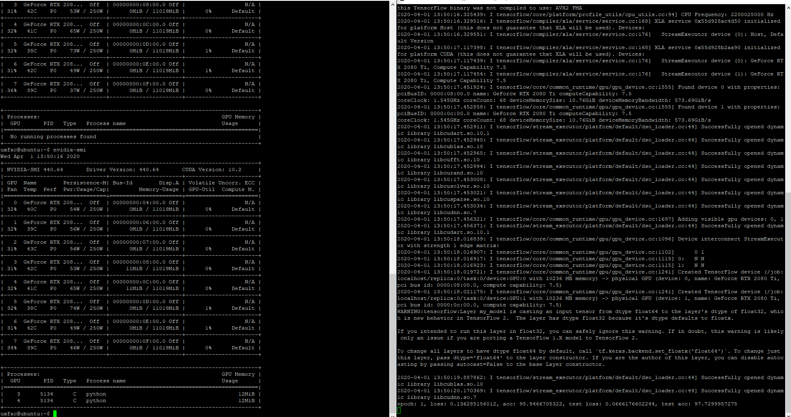

# Tensorflow Study  

## **중요** : GPU 0, 1 번 쓰지말것

## Docker

docker run --gpus '"device=3,4"' --name uxfac_gpu_tensor -dt -i tensorflow/tensorflow:latest-gpu /bin/bash  

docker exec -it uxfac_gpu_tensor /bin/bash  

## In Docker
apt update  
apt install -y vim git  
mkdir _git  
cd _git  
git init  
git clone https://github.com/TaeHoon-Roh/tensorflow_study.git  
python main.py

